<a id="top"></a>
<div align="center">


### Your cycle, your way.

Menstrual health, fertility and wellness tracking that stays on your device.<br>
Offline-first, ad-free, no account required.

<br>

[](https://github.com/lekhanpro/cyclecare/actions/workflows/ci.yml)
[](https://github.com/lekhanpro/cyclecare/actions/workflows/build-release.yml)
[](https://flutter.dev)
[](https://m3.material.io)
[](#testing)
[](LICENSE)

**[Download APK](https://github.com/lekhanpro/cyclecare/releases/latest)** ·
[Screenshots](#screenshots) ·
[Features](#features) ·
[Architecture](#architecture) ·
[Getting started](#getting-started) ·
[Status](#project-status)

</div>

---

<a id="screenshots"></a>
<div align="center">

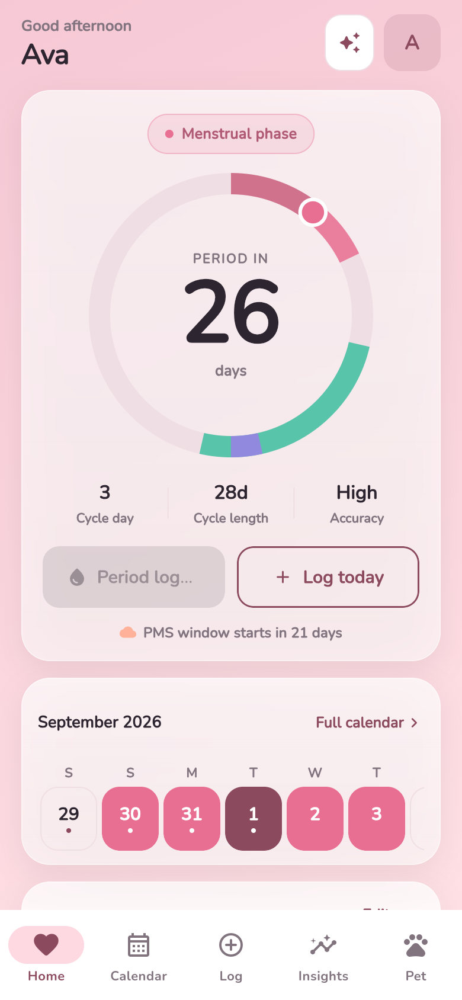
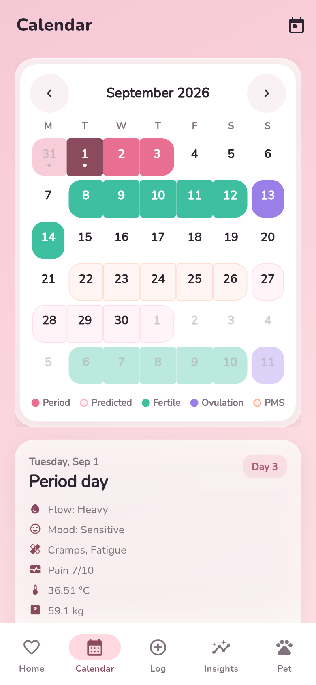
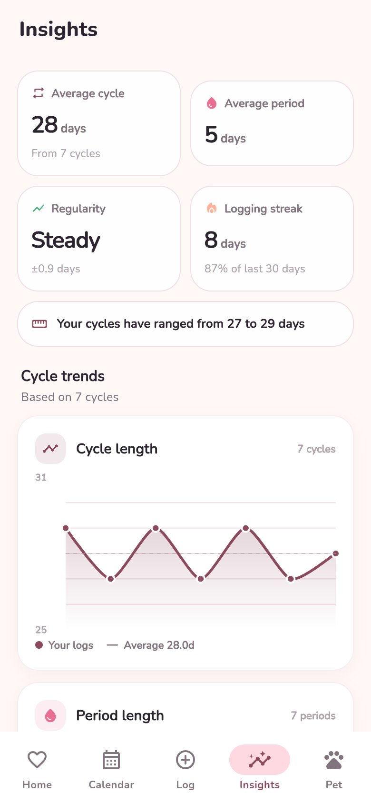
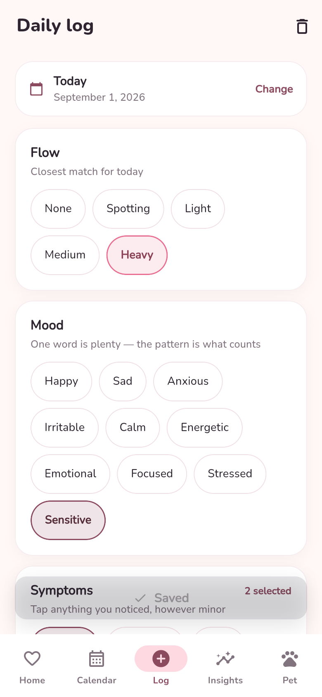

<sub>Home · Calendar · Insights · Daily log</sub>

</div>

---

## What it is

CycleCare is an open-source Flutter app for tracking periods, fertility signals
and everyday wellbeing. It is built around one constraint: **your health data
never leaves your phone unless you decide to move it.**

There is no sign-up wall, no analytics SDK, and no ad network. Every screen works
with the network switched off. Logging in is optional and gates nothing.

That constraint shapes the whole design. Predictions run on-device from the
cycles you have logged, and the app tells you how confident it is instead of
presenting an estimate as a fact.

---

## Features

### Tracking

|  | |
| --- | --- |
| **Cycle prediction** | Weighted moving average across your logged cycles, weighting recent ones more heavily. Reports a plain-language confidence level rather than a bare percentage, flags irregularity when the standard deviation crosses 4.5 days, and projects three cycles ahead — deliberately capped, because each projection compounds the error of the last. |
| **Calendar** | Period, predicted period, fertile window, ovulation and the premenstrual window, with a per-day detail sheet. Fertile and ovulation overlays can each be switched off. |
| **Daily log** | Flow, mood, 16 symptoms, pain 0–10, BBT, sleep, water, weight, cervical mucus / position / firmness / opening, medication, notes, plus your own custom symptom tags. |
| **Insights** | Cycle length, period length, regularity, symptom and mood frequency, pain and BBT trends, charted with `fl_chart`. |
| **Anomaly alerts** | A late period, an unusually long gap, persistent irregularity and possible amenorrhea surface as alerts on Home instead of being buried in a chart. |

### Health and learning

|  | |
| --- | --- |
| **Health conditions** | Plain-language explainers for PCOS, endometriosis, PMDD, perimenopause and amenorrhea, plus a pain diary and screening prompts. Nothing here diagnoses. |
| **Learn** | Searchable article library with categories and bookmarks. |
| **Pregnancy mode** | Due date from either a due date or a last period, week-by-week guidance, a kick counter with a 10-kick target, and an appointment list. |
| **Birth control** | Method picker, daily pill check-in with undo, current and longest streak, pack layout and start date, adherence stats. |

### Companion and sharing

|  | |
| --- | --- |
| **Virtual pet** | XP, levels, nine achievements, happiness and logging streaks. Feed and cuddle actions have cooldowns so it rewards habit, not grinding. |
| **Partner sharing** | Per-field consent toggles build a plain-text summary you copy or hand to the OS share sheet. Phase, next period and a support tip are on by default; mood, symptoms and fertile window are off. Nothing is uploaded. |
| **Reminders** | Six local notification types — period, ovulation, fertile window, daily log, pill and custom. |

### Privacy and control

|  | |
| --- | --- |
| **Local-first storage** | Every feature reads and writes `SharedPreferences` on the device. No backend is contacted. |
| **App lock** | Optional 6-digit PIN, hashed into `flutter_secure_storage`, plus biometric unlock. |
| **Your data, portable** | Export everything as indented JSON, or delete all of it, from Settings. |
| **Presentation** | Eight palettes, light / dark / follow-system, week-start selection, haptics toggle, and reduced-motion support throughout. |

<details>
<summary><b>More screenshots</b></summary>

<br>
<div align="center">

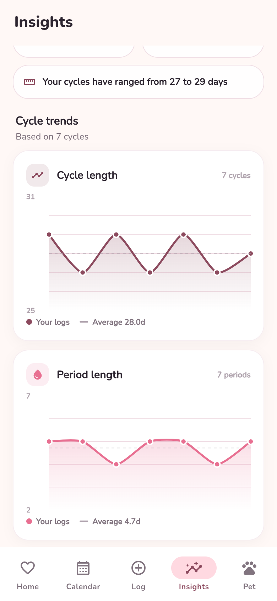
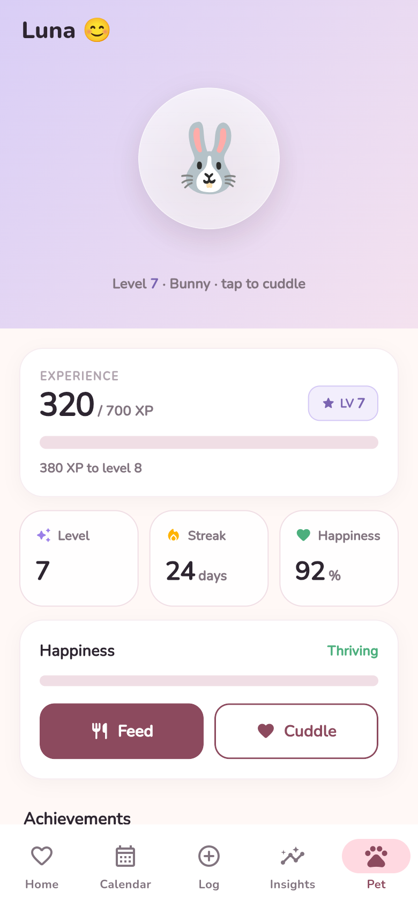
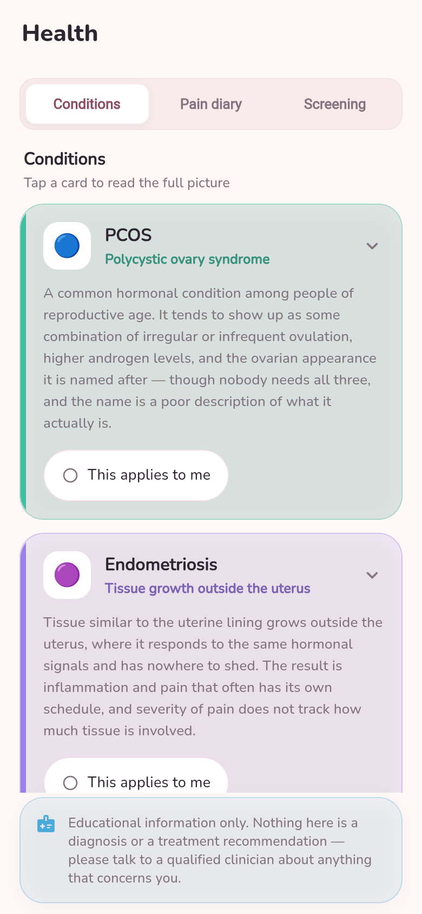
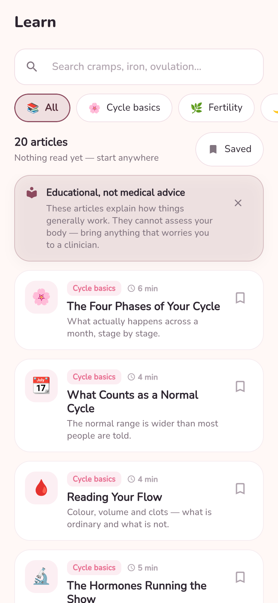
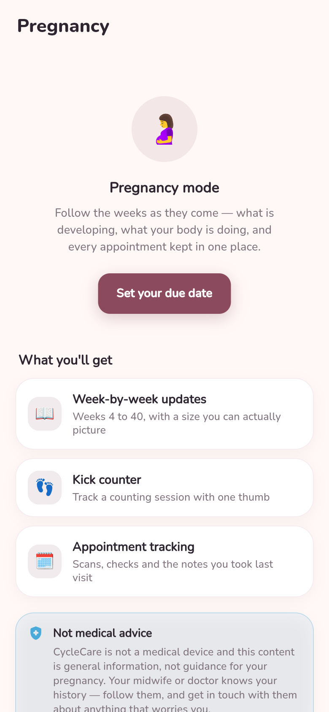
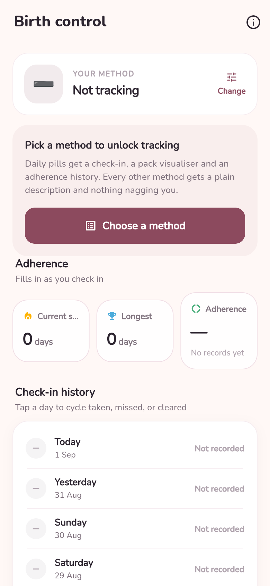
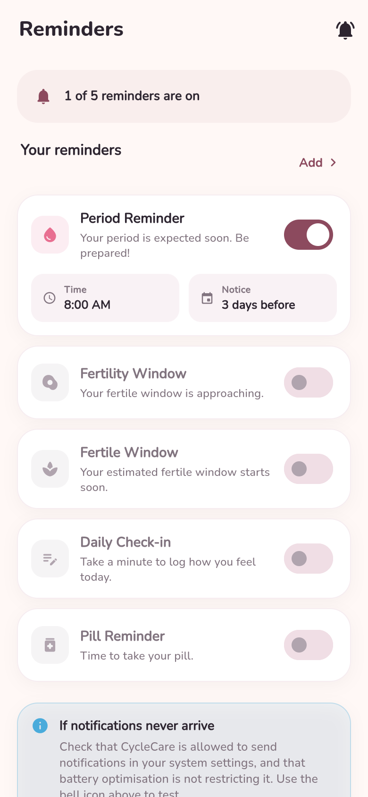
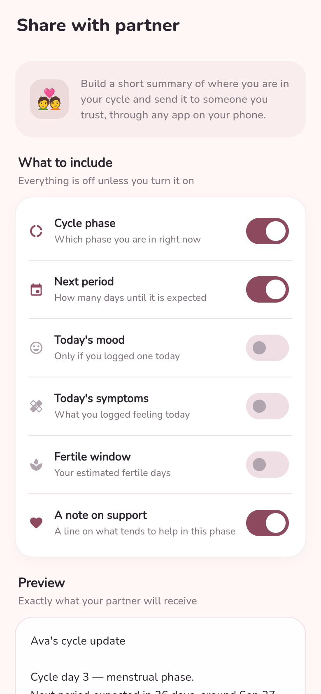
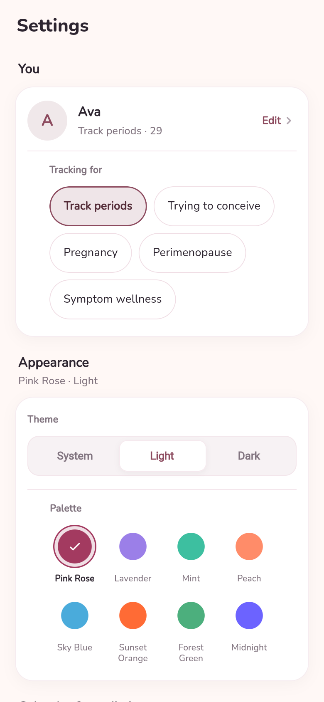

<sub>Trends · Pet · Health · Learn · Pregnancy · Birth control · Reminders · Partner sharing · Settings</sub>

<br><br>

**Dark theme**

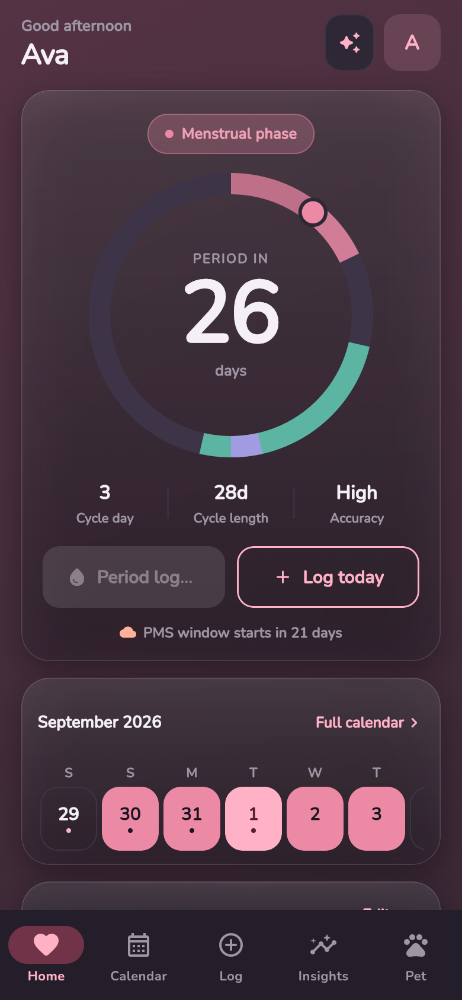
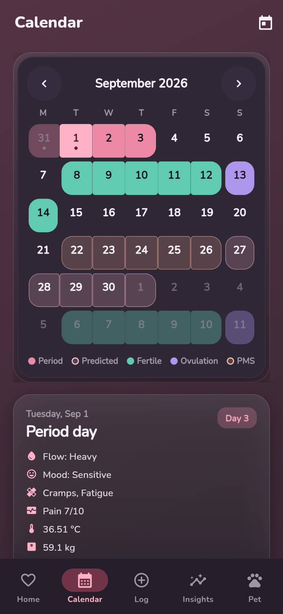
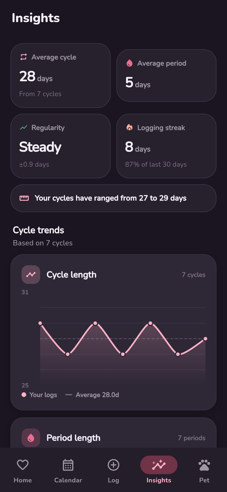
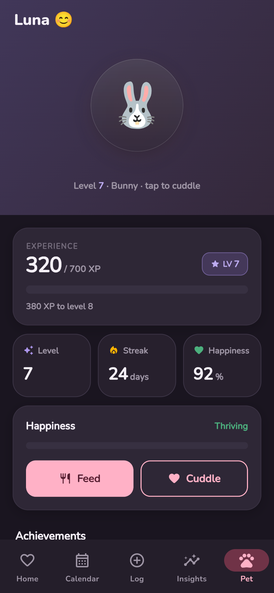

</div>
</details>

---

## Architecture

Feature-first, with the tracking domain split into layers because it is the only
part of the app with real logic to isolate. Everything else stays flat rather
than wearing four folders for one screen.

```
lib/
├── main.dart                       # bootstrap: dotenv, timezones, runApp
├── core/
│   ├── constants/                  # symptom, mood and copy constants
│   ├── providers/                  # app settings, auth (Riverpod)
│   ├── router/                     # GoRouter + StatefulShellRoute, transitions
│   ├── services/                   # notifications, security, auth, AI, haptics
│   ├── theme/                      # 8 palettes, phase colours, Nunito, motion
│   └── utils/                      # dates, PIN hashing, notification helpers
├── features/
│   ├── app/                        # MaterialApp, nav shell, app lock
│   ├── splash/ auth/ onboarding/   # first-run flow
│   ├── tracking/                   # the core domain
│   │   ├── domain/                 # prediction engine, analytics, models
│   │   ├── data/                   # CycleRepository (SharedPreferences)
│   │   ├── application/            # CycleTrackerController, custom tags
│   │   └── presentation/           # home, calendar, log, insights
│   ├── ai/ pet/ pregnancy/         # companion features
│   ├── birth_control/ health/      # health features
│   ├── education/ reminders/
│   ├── partner/ settings/
└── widgets/                        # design system: cards, chips, ring, calendar
```

Five bottom-nav destinations — **Home, Calendar, Log, Insights, Pet** — live in a
`StatefulShellRoute.indexedStack` so each keeps its own scroll position.
Everything else pushes over the shell, which is why Settings and Pregnancy have
no nav bar.

Routing never consults auth state. The only gate is an `onboardingCompleted`
flag in local preferences, which is what makes the no-account path real rather
than advertised.

### Design system

Flat by default: cards sit at elevation 0 with a 22px radius on a cream
`#FFF8F6` canvas, in Nunito at heavy weights. Phase colours are deliberately
**excluded** from the palette system — rose always means period, teal always
means fertile — so changing your accent colour never relabels your data.

### Stack

| | |
| --- | --- |
| Framework | Flutter 3.24.5 · Dart 3.5.4 · Material 3 |
| State | `flutter_riverpod` |
| Routing | `go_router` |
| Storage | `shared_preferences`, `flutter_secure_storage` |
| Charts | `fl_chart` |
| Notifications | `flutter_local_notifications` · `timezone` |
| Security | `local_auth` · `crypto` |
| Type | Nunito via `google_fonts` |

---

## Getting started

**Requirements** — Flutter 3.24.5 (see [compatibility](#compatibility)), Android
SDK 35, Java 17.

```bash
git clone https://github.com/lekhanpro/cyclecare.git
cd cyclecare
flutter pub get
flutter run
```

That is the whole setup. No `.env`, no Firebase config, no Supabase project —
the app is fully functional offline and will take you through onboarding into a
working install.

### Building

```bash
flutter build apk --release          # APK
flutter build appbundle --release    # Play Store bundle
```

Release builds need signing config in `android/key.properties`:

```properties
storePassword=…
keyPassword=…
keyAlias=cyclecare
storeFile=cyclecare-release.jks
```

```bash
keytool -genkey -v -keystore android/app/cyclecare-release.jks \
  -keyalg RSA -keysize 2048 -validity 10000 -alias cyclecare
```

### Compatibility

CI pins **Flutter 3.24.5**, and that is the version to use. On Flutter 3.27 and
newer the build fails until three renamed Material classes are updated in
`lib/core/theme/app_theme.dart` — `CardTheme` → `CardThemeData`, `DialogTheme` →
`DialogThemeData`, `TabBarTheme` → `TabBarThemeData` — and `google_fonts` is
raised to `^8.x`, which drops a `const` map that newer Dart rejects.

### Brand assets

The logo, launcher icons, favicons and social preview are all generated from one
set of geometry constants. See [`assets/brand/`](assets/brand/README.md).

```bash
python tool/brand/generate_svg.py    # vector sources
python tool/brand/rasterize.py       # every PNG, all platforms
```

---

## Testing

43 test cases across six suites, all passing.

```bash
flutter test
flutter test --coverage
```

| Suite | Cases |
| --- | --- |
| `test/unit/cycle_analytics_test.dart` | 20 |
| `test/unit/cycle_prediction_engine_test.dart` | 13 |
| `test/unit/date_utils_test.dart` | 5 |
| `test/widget/health_screen_smoke_test.dart` | 3 |
| `test/widget/app_test.dart` | 1 |
| `test/presentation/screens/home_screen_test.dart` | 1 |

The prediction engine carries the most coverage because it is the part users
trust with a number.

### CI

| Workflow | Trigger | Does |
| --- | --- | --- |
| `ci.yml` | push to `main` / `develop`, PRs | analyze, test, build debug APK |
| `build-release.yml` | tag `v*.*.*` | test, analyze, signed APK + AAB, GitHub release |
| `pages.yml` | push to `main` | publishes `docs/` |

---

## Project status

Honest accounting of what is wired and what is scaffolding.

**Working end to end** — local-first storage, prediction engine, calendar,
daily logging, insights, anomaly alerts, virtual pet, reminders, birth control,
pregnancy mode, health library, education library, partner text sharing, app
lock, export and delete, theming.

**Not wired yet:**

| Area | Reality |
| --- | --- |
| **AI assistant** | The chat screen, safety-framed prompt builder and disclaimer all exist, but the provider is a placeholder that always errors — no model is reachable. A Groq-backed Supabase Edge Function sits in `supabase/functions/ai-assistant/`, and no Dart code calls it. |
| **Cloud sync** | `supabase_flutter` and Firebase are in `pubspec.yaml`, but `Supabase.initialize` is never called and `firebase_sync_service.dart` is a stub. Signing in works and syncs nothing. |
| **Partner dashboard** | Sharing is a local text summary. There are no invite codes and no partner view; an earlier random-code UI was removed because nothing was behind it. |
| **iOS** | The Xcode project and icon set are in place, but only Android Firebase options are compiled in, so push is Android-only today. |

**Known bug** — the pet screen's XP and happiness meters render empty. Their
`FractionallySizedBox` sets only `widthFactor` inside an `Align`, so the gradient
fill collapses to zero height.

---

## Privacy

- All cycle, log, pet and settings data is stored locally via `SharedPreferences`.
- The app makes no network calls in normal use. Fonts are fetched by
  `google_fonts` on first launch and cached.
- No analytics, crash reporting, advertising or tracking SDK is included.
- Partner sharing produces text you copy or share yourself — there is no server.
- Export and delete are both one action away in Settings.

---

## Medical disclaimer

CycleCare is for **education and personal tracking only**. It is not a medical
device and does not provide medical advice, diagnosis or treatment. Predictions
are estimates derived from the data you enter and will be wrong sometimes.
**Do not rely on CycleCare as contraception.** For anything that concerns you,
talk to a qualified clinician.

---

## Contributing

Issues and pull requests are welcome.

1. Fork and branch: `git checkout -b feature/your-change`
2. Keep to the existing style — `flutter analyze` should stay clean
3. Add or update tests for logic changes
4. Commit conventionally: `feat: …`, `fix: …`, `docs: …`
5. Open a PR describing what changed and how you verified it

Good first contributions: wiring a real AI provider behind the existing chat
UI, the pet meter fix above, replacing deprecated `withOpacity` calls with
`withValues`, or adding iOS Firebase configuration.

---

## License

[MIT](LICENSE)

<div align="center">
<br>

<br><br>
<sub>Built with Flutter. <a href="#top">Back to top</a></sub>
</div>
